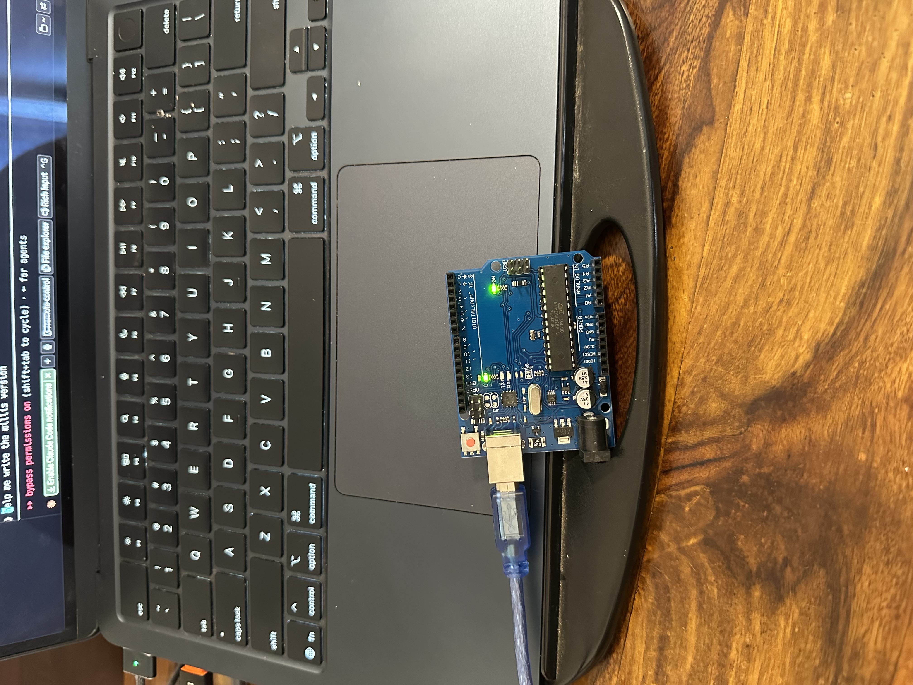
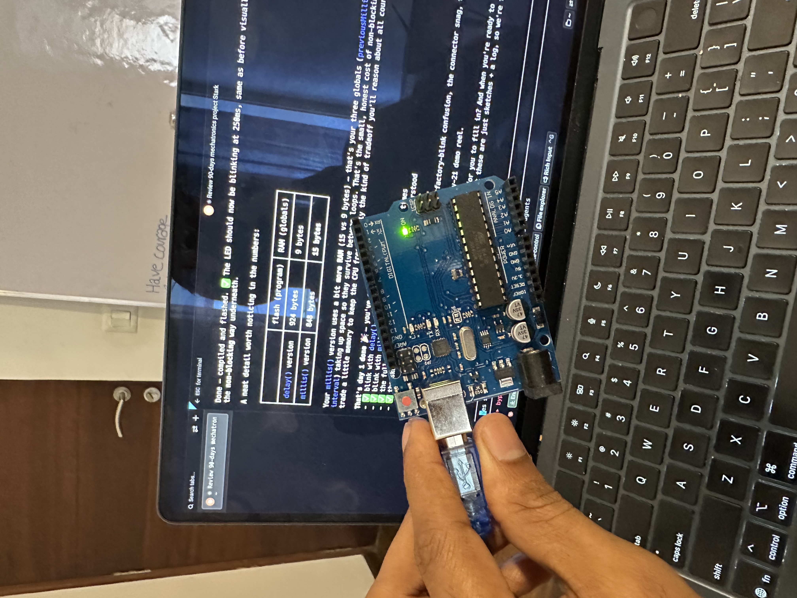

# day 1 — 2026-07-08

**goal:** blink the on-board LED with my own code, then rewrite it without `delay()` using `millis()`, and understand the sketch skeleton every arduino program shares.

## what i built
- a blink sketch on pin 13 (the on-board LED) using `delay()`, my own code, my own rate
- a second version using `millis()` instead of `delay()`, so the loop never freezes
- flashed both to the board straight from the command line, no arduino IDE

## what broke
- honestly, not much. the whole day was smooth.
- the one bottleneck was the cable. i had a USB-A to USB-B cable, but my mac is USB-C only, so there was no way to plug the arduino in. bought a USB-C adapter, plugged it through that, and it worked instantly. that was the only real blocker.
- minor confusion at the start: the board was already blinking before i uploaded anything. turns out a new uno ships with the blink example pre-loaded from the factory. once i uploaded my own version at a different rate, i saw it change, which proved my code was actually running.

## what i learned
- you can control the arduino entirely from the CLI (`arduino-cli compile` and `upload`). no IDE needed. that means i can run the whole edit -> compile -> upload loop by just talking to claude code, or do it myself in cursor. super useful.
- the difference between `delay()` and `millis()`: `delay()` freezes the whole board while it waits. `millis()` keeps the loop running and just checks the clock each pass, flipping the LED only when enough time has gone by. same blink, but `millis()` leaves the board free to do other things, which is what real robots need.
- uploading overwrites the board's single program slot, it doesn't add to it. whatever i flash last is what runs.

## photos / clips

<video src="https://github.com/ritvikvarghese/stark/raw/main/media/day-01/clip-1.mp4" controls width="480"></video>

<video src="https://github.com/ritvikvarghese/stark/raw/main/media/day-01/clip-2.mp4" controls width="480"></video>

