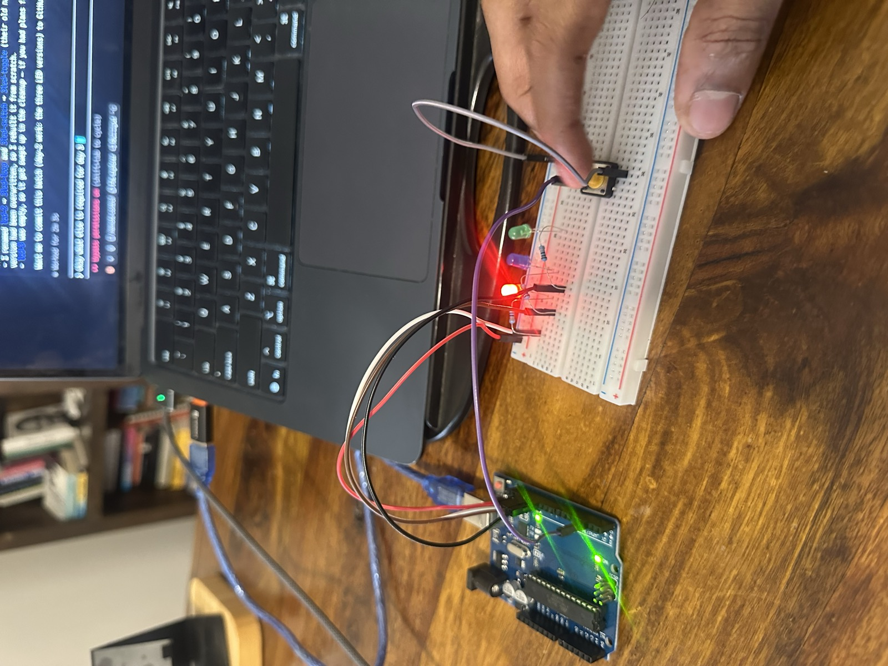
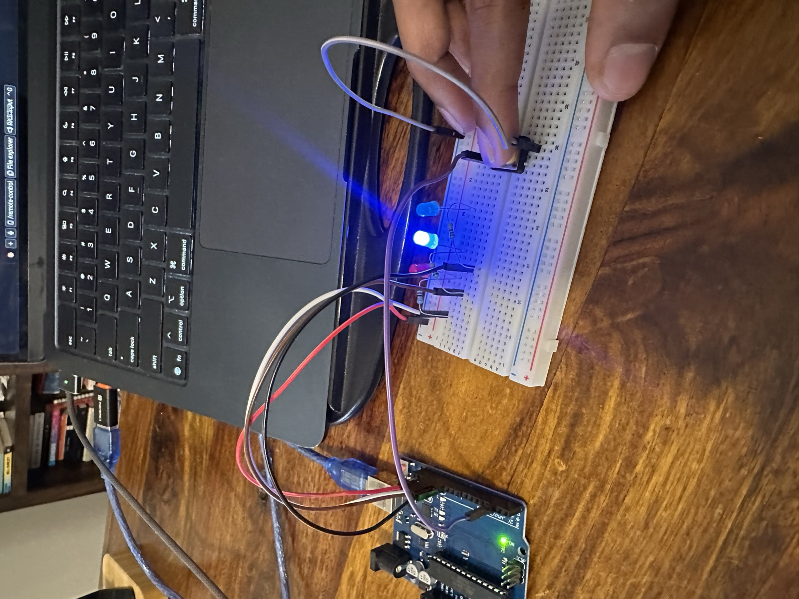

# day 2 — 2026-07-09

**goal:** make a button work and use it to control the three-LED circuit. learn digital input, pull-up resistors, and debouncing.

## what i built
- started with the plain orchestration of three LEDs: a simple loop on pins 13, 12, and 11, cycling red, blue, green. no button, just the basic loop.
- then brought a button (on pin 2) into both the circuit and the code, in two formats:
  - **toggle** — click once to start the cycle, click again to stop it.
  - **hold** — hold the button to run the cycle, release to stop instantly.
- all three versions are saved in `projects/01-fundamentals`: `3led-loop`, `3led-hold`, `3led-toggle`.

## what broke
- the button didn't work the first time i tried it. we tested it with a serial print so i could watch the pin, and it eventually came right. a lot of the early trouble turned out to be failed uploads (the board kept dropping off its port), not the circuit itself.
- i didn't know how to use a multimeter yet, which is exactly the tool that would have tested the button in two seconds. that's the next thing i'm going to learn.

## what i learned
- how the arduino supplies voltage and current: it can put 5V out on a pin, and i now get how the whole circuit path works, pin to LED to resistor to ground.
- the button is NOT wired into the LED circuits. they are completely independent. the button is just an input that tells the arduino its state, and the arduino watches pin 2 and decides whether to run the LEDs. the LEDs don't listen to the button directly, the code is the middleman.
- basic C++ types: integers, strings, and floats, plus `const` for values that never change. it's very similar to python, just more low-level and "computer coded."
- most of today's code i didn't write myself, and i'm ok with that. the point isn't to type it out if the AI can write it. what matters is that i can read it, revise it, and understand it, which i can.

## clips

<!-- for the inline player: edit this file on github.com and drag media/day-02/3led-button.mp4 onto the line below -->
▶️ [3-LED button demo (archived, click to view)](../media/day-02/3led-button.mp4)

## photos

