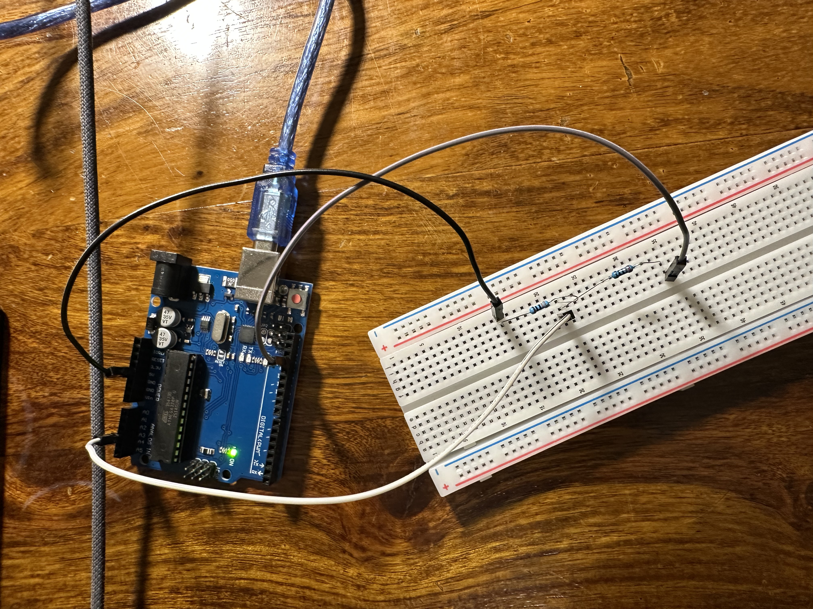
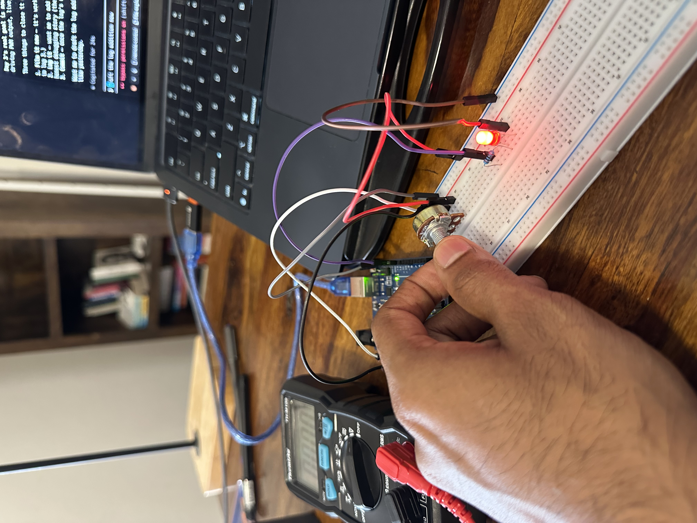

# day 3 — 2026-07-09

**goal:** learn analog input and analog output. read a real voltage into the arduino (analog read) and dim a light with PWM (analog write). math: ohm's law / voltage divider.

## what i built
- a voltage divider on the breadboard: 5V from the arduino into the board, two resistors in series (330Ω then 220Ω), a jump wire closing the circuit to ground, and a jump wire from **A3** to the junction between the two resistors. that middle point sits at a fixed 2V, and the arduino reads it with `analogRead`. sketch is `analog-read-1`.
- i didn't have a potentiometer today, so the fixed resistor divider stood in as my analog input — a steady voltage instead of a knob i can turn. i'm picking up a pot tomorrow to do the real "turn a knob, dim a light" version and i'll add it on top of this log.
- **analog write (PWM):** dimmed an LED by writing values 0–255 to a pin. tried fixed brightness levels and a 5-step sequence that cycles through brightness. sketch is `analog-1`, video below. this maybe wasn't strictly on today's list but i did it and it fits the "analog" theme, so it's in.

## what broke
- uploads kept failing with `not in sync` — the board just wouldn't take the new code. turned out the USB serial connection had wedged; unplugging the cable and plugging it back in fixed it.
- the big confusing one: the analog read looked completely dead, no numbers showing up at all — even though the arduino was reading and printing fine the whole time. the giveaway was the **TX light blinking once a second**, which is literally the board sending data down the cable. so the board was never the problem. the problem was on the laptop side: the tool reading the serial port kept snapping back to the wrong baud rate, so it read garbage or nothing. claude finally locked the baud rate correctly and the numbers came through.
- at first A3 read a flat **0**. the tap wire was sitting on the ground side of the divider instead of on the junction between the two resistors. moved it up to the junction and it jumped to the right value.

## what i learned
- **ohm's law / voltage divider:** two resistors in series split the 5V in proportion to their size. the 330Ω drops 3V, the 220Ω drops 2V, and they add back to 5V. i checked it on the multimeter and it matched.
- **analogRead gives a number, not volts.** it's a 0–1023 scale (10-bit): 0 means 0V, 1023 means 5V. to turn it into real voltage: `voltage = reading / 1023 × 5`. my reading of 414 came out to **2.02V** — same as the multimeter's 2V. that conversion (turning the chip's internal scale into volts i can actually understand) was the click moment of the day.
- **the int vs float trap:** if you write `(5 / 1023)` as plain integers, it divides down to 0 and your voltage is always 0. you have to write `5.0 / 1023.0` and store the result in a `float`. that's the whole reason paul splits the code into `readval` (the raw number) and `V2` (the real voltage).
- both analog **read** and analog **write** are done. the knob + LED version is tomorrow.

## day 3 continued (2026-07-10) — knob dims a light

picked up a potentiometer and did the real version of the day's goal: turn a knob, dim a light. sketch is `dim-lit`.

**what i built:** wired the pot as an analog input on **A3**. the wiper feeds a voltage between 0V and 5V into the arduino, and i use that reading to set the PWM voltage going to the LED. turn the knob → the LED smoothly brightens and dims across the full range. that's the whole point of the day: an analog input i control with my hand, driving an analog-style output.

**what broke:** the only real snag was the pot's **legs**. its three legs are spaced two columns apart, not next to each other, so i'd misidentified them and wired **A3 and ground to the wrong holes** on the breadboard — the wiper leg wasn't even in the column i thought it was. that left A3 floating, so the LED just sat at one constant brightness instead of dimming. found it with the multimeter (the wiper read a flat 0V no matter how i turned the knob), moved the legs to their real spacing, and it worked perfectly. lesson: don't assume a component's legs sit in adjacent holes — check exactly which columns each leg actually reaches.

## clips

https://github.com/user-attachments/assets/7f760f3f-fbec-4146-95f3-0cb343952909

<!-- for the inline player: edit this file on github.com and drag media/day-03/knob-dim.mp4 onto the line below -->
▶️ [knob dims LED demo (archived, click to view)](../media/day-03/knob-dim.mp4)

## photos

