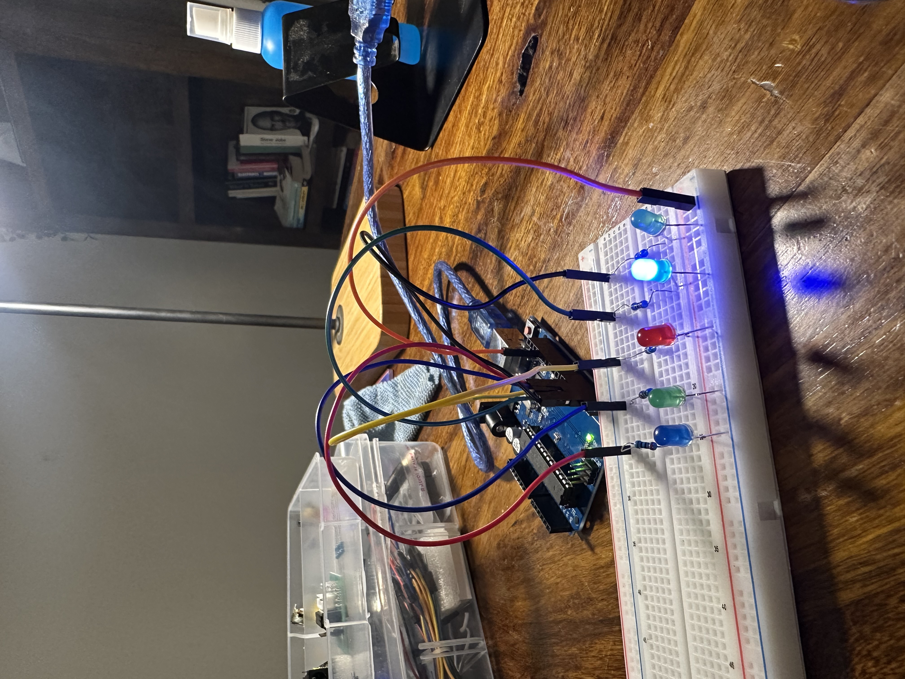

# day 4 — 2026-07-13

**goal:** serial + the tiny voltmeter, then c++ consolidation — loops, arrays, functions — built into a knight rider scanner. also: confirm the arm kit.

## what i built
- the **knight rider scanner** — 5 LEDs in a row (pins 2–6), a lit dot that sweeps left→right then bounces back right→left, forever. sketch is `knight-rider`. this was the main build of the day and i wrote it myself: an array of the pins, a for-loop to sweep up (`i` 0→4), and a second for-loop to sweep back down (`i` 4→0). the `setup()` also uses a loop over the array to set all 5 pins to OUTPUT instead of five separate `pinMode` lines.
- an **if-statement sketch** (`if-1`): read the pot voltage and turn an LED on only when it crosses 4V — a voltage-triggered switch. small, but it's `if/else` working on real hardware.
- **rebuilt the potentiometer circuit and a bunch of the earlier circuits** to retest all the code i'd already written (voltmeter, dim, if). good to prove the old sketches still run on freshly-wired boards, not just the day i first built them.
- the serial + voltmeter half of the day was basically already done on day 3 (`analog-read-1` is the voltmeter — read a pin, `reading * 5.0/1023`, print volts, and i cross-checked it against the multimeter: 2.00V by hand vs 2.02V from the arduino). so today was mostly the c++ side plus a lot of revision.

## revision
- did a full **revision of days 1–3**: the sketch skeleton, `delay()` vs `millis()`, one program slot, buttons + pull-ups + debouncing, `digitalWrite` vs `analogWrite`, and the 0–255 / 0–1023 scales. answered the recall questions in my own words and they held up.
- **revised arrays** properly, and honestly they were instant because i already know them from python.
- learned **for loops** (built the scanner with them) and covered **while loops** at the concept level — for = "repeat a known number of times", while = "keep going until a condition changes". `loop()` itself is a while-loop the board runs for me. didn't drill while separately, it wasn't needed today.

## what broke
- the big one: for a while i was debugging a "broken" dim circuit that was actually **wired perfectly** — the problem was the board was still running the *wrong sketch*. earlier the USB port had dropped (wedged USB, silent failed upload), so a dim-lit re-flash never landed and the board was still running `3led-toggle`, which ignores the pins the dim circuit uses. lesson burned in: **confirm the right sketch actually flashed (exit 0) before touching the wiring.** an upload isn't done just because you clicked it.
- the **pot read stuck between ~1.1V and 1.84V** and never hit 0 or 5V — classic floating pin. the wiper jumper was on the wrong analog pin, so the pin was reading noise. moved it and it swept a clean 0.00→5.00V.
- the scanner had a few self-inflicted bugs while i wrote it: an **empty `delay()`** (needs a number), a stray `c` typo, and the important one — i'd **nested the reverse loop inside the forward loop** instead of putting them side by side, so the two sweeps fought each other. fixing the braces (two sibling loops, not one inside the other) sorted it.
- `if-1` also had a couple of typos at first — a variable with no type and a misspelled name. small stuff, but it's the reminder that C++ makes you declare everything explicitly.

## what i learned
- coming from **python, this all feels really familiar** — C++ is basically a dumbed-down, more computer-readable python, or the other way round, python is a human-friendly version of C++. the concepts (arrays, loops, if) map straight over; the only tax is C++ making you spell out types and declarations. the exact syntax isn't as easy, and that's fine — i don't think you really need to *memorise* code when you're pairing with an LLM. what matters is that i can read it, reason about it, and catch the bugs, which i can.
- **nested vs sequential loops:** a loop inside a loop means "for every step of the outer, run the whole inner." two things that should just happen one after another are *siblings*, not nested. getting that wrong is what broke the bounce.
- **the polish tweaks:** i'd put an 80ms delay *after* the LED goes LOW as well as before, which left a dark gap between LEDs so it blinked along. removing the delay-after-LOW made the dot glide continuously — it genuinely looked like a little train running down the row. (also fixed a double-blink at the two ends by having the reverse sweep skip the LEDs the forward sweep already lit.)

## wiring / craft
focused hard on **clean, premium-looking wiring** today, not just getting it working. used the resistor across the divider to keep it tidy and cut down the wire count, and ran the LEDs straight to the ground rail so the board didn't turn into a rat's nest. the whole thing looked deliberate rather than thrown together, and it made debugging easier too.

## admin
- **bought the SO-101 arm kit today** — this is the critical gate on all of phase 3, so it's a big one off the list. no more waiting on the longest-lead item.
- the **3D printer got delivered** — genuinely excited about this one. it prints the video robot's body and the phase-4 camera mounts later.

overall a pretty fantastic day: finished the scanner, locked in the c++ fundamentals, retested everything i've built so far, and both big pieces of hardware (arm + printer) are now in hand.

## clips
https://github.com/user-attachments/assets/65007c43-9d44-46cf-a035-c0658519032e

https://github.com/user-attachments/assets/7baebb17-211d-403d-b438-1e821de1c4a6

## photos

