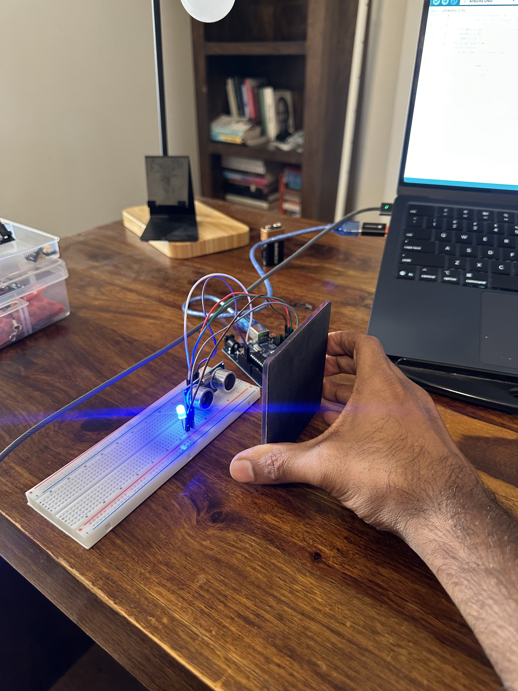
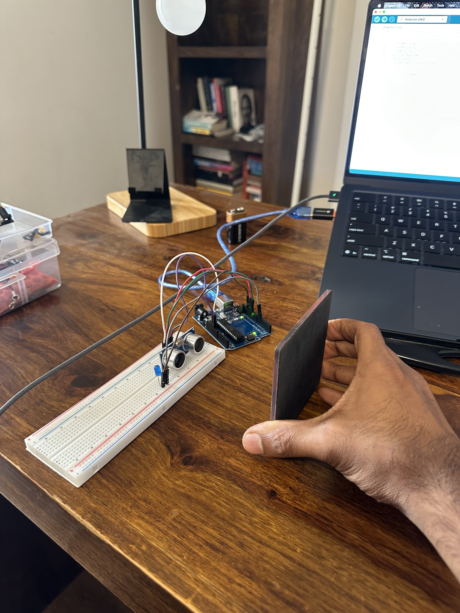

# day 5 — 2026-07-14

**goal:** hc-sr04 ultrasonic — read the datasheet, measure the ping travel time by timing the echo, then build a parking sensor on the breadboard.

## what i built
did it as two sketches, on purpose:
- **`ultrasonic-1` — no LED.** the bare sensor. fire a trigger pulse (LOW → 10µs HIGH → LOW), then `pulseIn(echoPin, HIGH)` to read how long the echo pin stays high, and print that in microseconds. this is mcwhorter's version — just characterise the sensor, no distance math yet.
- **`ultrasonic-2` — with the LED.** same trigger + `pulseIn`, then the distance formula, then a proximity LED on pin 6 that turns on when something's closer than 10cm. this is the actual parking sensor: `if (distance < 10) LED on, else off`. wrote the formula and the if/else myself.

circuit was genuinely easy — VCC to 5V, ground to ground, trig to 12, echo to 11, and one LED for part 2. nothing on the wiring side broke.

## what i learned
- **how ultrasonic ranging works, and it's very intuitive:** the sensor throws out a ping, it hits an object and bounces back, and you time how long that round trip takes. that's it — same idea as radar/lidar but with sound.
- **why you divide by 2:** the echo time is the *round trip* — the ping goes out to the object AND comes back. so the actual distance is only half of that travel. `distance = time × 0.0343 / 2` (0.0343 cm/µs is the speed of sound). the ÷2 is the whole trick.
- **`long` vs `int`:** `pulseIn` returns microseconds which can get big (up to ~1,000,000 on a timeout), so it has to be a `long` — an `int` maxes at 32,767 and would overflow into garbage. coming from python where ints are just ints, having to pick a size that fits is the new thing.
- **the serial monitor for live output:** downloaded the arduino IDE this morning instead of only driving uploads from the terminal, mostly to *see* how uploads work and watch values print live. the serial monitor (set to 9600 baud) streams whatever you `Serial.println` in real time — hold the target closer and the number drops, move it away and it climbs. that live feedback loop was a genuinely cool moment. the serial plotter graphs the same thing if you want it visual.

## what needs improving
- **uploading new sketches from the IDE was the one rough spot today.** the circuit was fine, the code compiled fine, but the IDE kept hanging on upload — sometimes "resource busy" (the serial monitor was still holding the port), sometimes avrdude "not in sync / programmer not responding" (the board wasn't dropping into its bootloader). fixes that worked: close the serial monitor before uploading, unplug/replug the board, or just flash from `arduino-cli` which was more reliable than the GUI. need to get smoother at this — it's a tooling thing, not a code thing, but it slowed me down.

## admin
- **bought an arduino nano** for future builds — cleaner, smaller layouts down the line. the uno r3 is more than enough for everything right now, no rush to switch, just having it ready.
- skipped the ruler-calibration homework (couldn't find a ruler) — the slope check (does my measured cm/µs match 0.0343/2) is deferred, not dropped.

overall a simple, smooth day — the sensor was intuitive, the circuit was quick, and both exercises worked. pretty happy to have knocked it out first thing in the morning.

## clips
<!-- drag-drop the video here on github.com (converted mp4 is in ~/Downloads):
     - day-05-ultrasonic.mp4
     then `git pull --rebase` to bring the attachment URL back down -->

## photos

