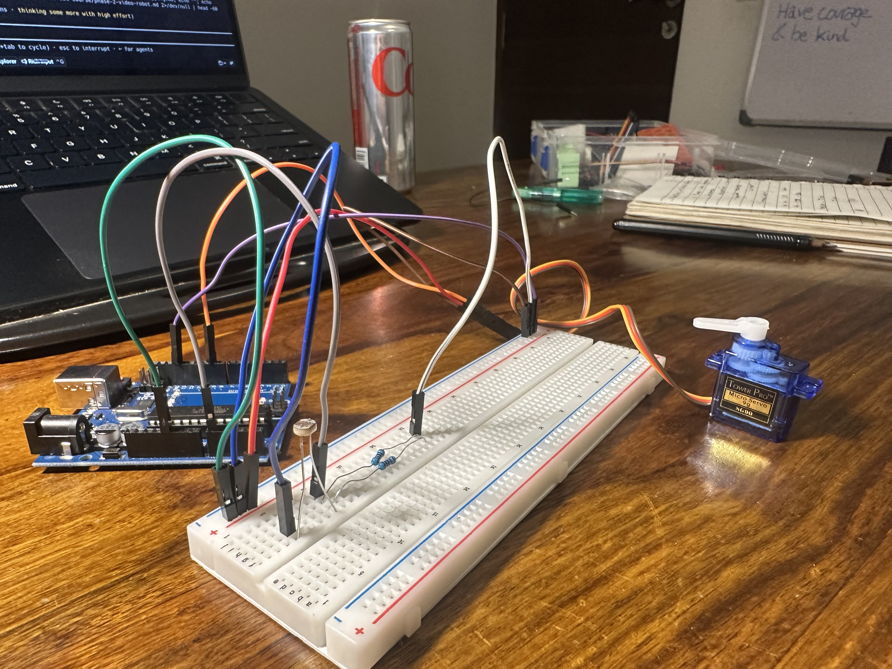
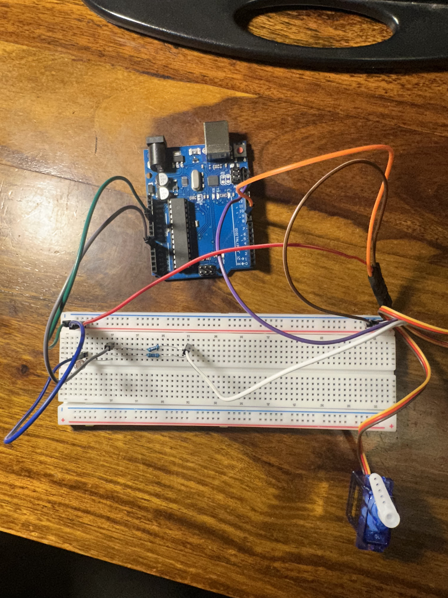
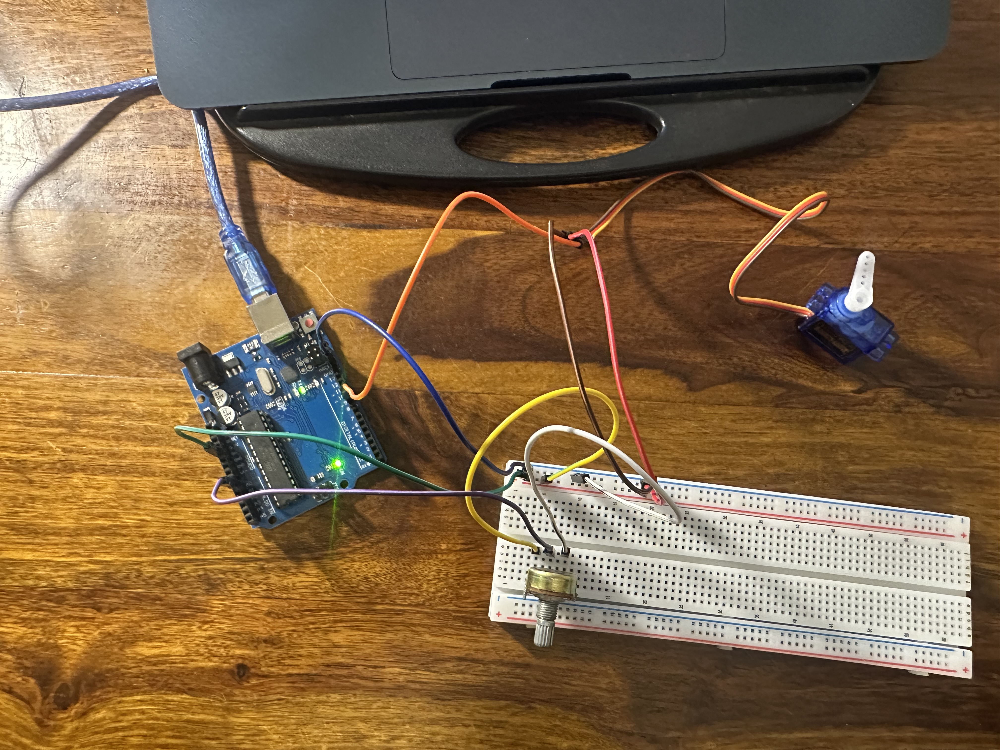

# day 6 — 2026-07-15

**goal:** sg90 servo — sweep, then knob-controls-angle, and learn the 50hz pulse trick. plus the photoresistor work that led into it.

## a note on pacing
this one got spread out and i'm running a touch behind the plan. yesterday i did the while-loop revision and got my first introduction to photoresistors; today i finished the photoresistor circuits and went all the way through the servo material. so day 6 is a bit delayed, but all of it is done.

## what i built
worked up through four circuits, each one building on the last:
- **photoresistor → LED.** the first real photoresistor circuit — read the light level off the divider and switch between a **red and a green LED** depending on how bright it is. dark lights one, bright lights the other. nothing broke.
- **photoresistor → servo (angle bands).** same photoresistor reading, but instead of LEDs it drives a servo. i set **different conditions for the angle** — the servo jumps to one of a few fixed positions depending on the light band (dark / medium / bright). my own variation, not in the plan, but it locked in the "analog reading drives an output" idea.
- **servo sweep.** the plan's first servo exercise — a plain **180° sweep back and forth**, the servo walking 0→180→0 on its own with a for-loop. the servo's "hello world."
- **knob → servo.** the plan's second one, and the best of the day: a **potentiometer drives the servo angle** smoothly. `map()` scales the knob's 0–1023 to 0–180 and the servo follows the knob one-to-one. pretty cool to feel it track.

honestly nothing really broke on any of these. my understanding of circuits feels close to near-perfect now — the divider, the rails, reading analog in, driving outputs, it all clicks.

## what i learned
- **you can build your own rails from a single 5V.** i only had one 5V pin but learned you run it to the breadboard's **positive rail**, and run GND to the **negative rail**, and now every component taps the same 5V and ground in parallel. one pin feeds the whole board. new to me today.
- **a standard servo only goes 180°.** i tried to make it do a full **360° and it just didn't work** — the SG90 has a physical stop and `servo.write()` ignores anything past 180. so 180 is the ceiling on this hardware; 360 needs a different kind of motor entirely.
- **`map()`** is the clean way to rescale one range (knob 0–1023) onto another (angle 0–180).

## workflow — writing in the arduino IDE now
i've switched to **writing my code in the Arduino IDE directly** instead of Cursor. Cursor makes it a little too easy — the autocomplete does the thinking for me. In the IDE i'm actually challenged, i have to recall the syntax myself, and that's the point. I still drop into Cursor when i'm genuinely stuck or want to check something, but writing-first happens in the IDE now. That's a practice i want to take more seriously.

## what needs solving
- **noise in the readings.** there's a real amount of jitter/noise, especially once the servo is moving on the shared power — it even garbled the serial output. this needs to be solved properly. i've **bought a capacitor** for exactly this, i just **still need to figure out how to actually use it** (across the servo power, to smooth the current spikes). that'll happen whenever it happens next.
- uploads are still a bit finicky — the board occasionally won't sync on the first try and i have to replug or retry. not a code problem, just the mac/usb being fussy.

## clips
https://github.com/user-attachments/assets/8ad0da9d-c0ab-4d08-b84d-eb49c71bed8b

https://github.com/user-attachments/assets/f4d857ba-85a3-406e-a04d-7b130a4024db

https://github.com/user-attachments/assets/8f61c126-b7d5-4c6a-ae56-0a5f26c0e144

https://github.com/user-attachments/assets/3373e48b-c21d-4bdf-bed4-b682e431a423

## photos

