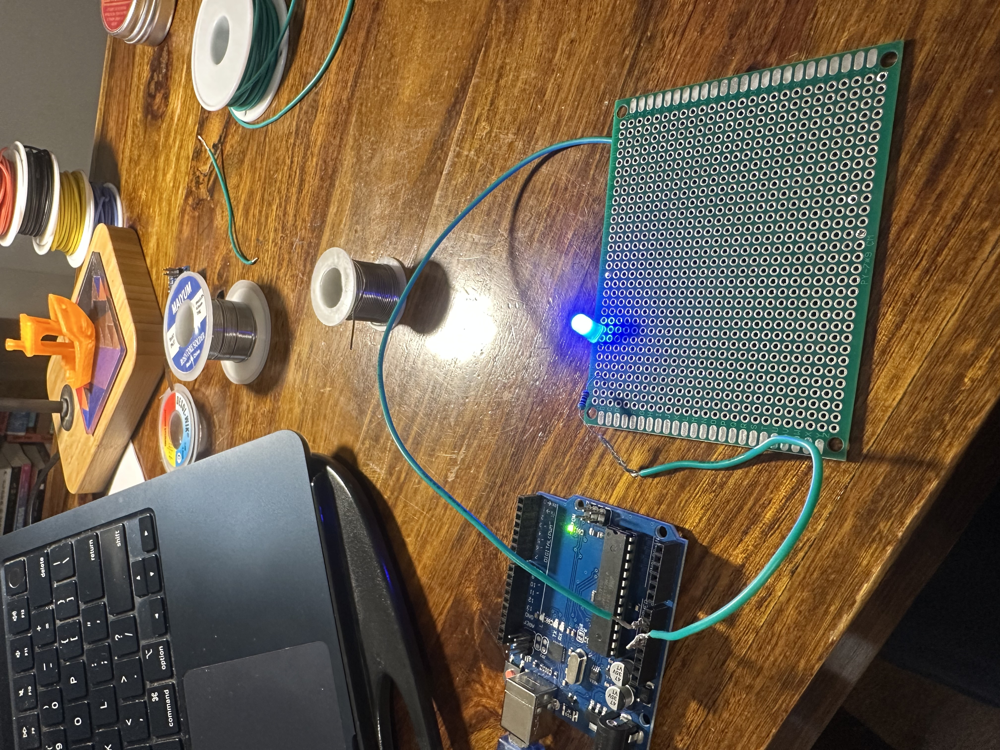
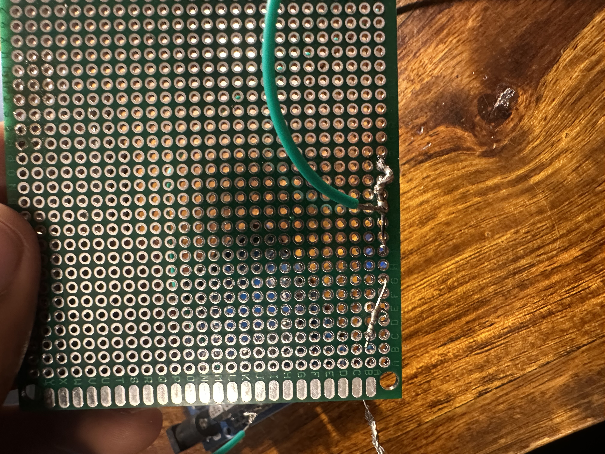

# day 8 — 2026-07-20

**goal:** learn to solder — tin the tip, heat the joint not the solder, read good vs cold joints, and use the wick. practice only, no permanent build. (soldering slipped to today; the pinecil got swapped for a 60W adjustable iron that arrived monday.)

## what i built
- my **first real soldered circuit** (not a breadboard): an **LED + resistor** soldered onto the practice end of the 7×9 perfboard, powered straight off the Arduino's **5V**. no code — 5V is always-on, so the LED lights the moment the board has power. wiring it to 5V instead of a digital pin makes it a pure soldering test: if it's dark, it's a solder/wiring problem, never code.
- circuit: **5V → resistor → LED(anode) → LED(cathode) → GND**, the resistor and LED legs joined on the back of the board, stranded green hookup wire running out to 5V and GND.

## what broke
- **first attempt: dead, LED wouldn't light.** not 100% sure of the single cause, but two likely culprits: (1) the power wire probably wasn't seated in **5V** — early on it was sitting near GND / pin 13, which is 0V with no code to drive it; and (2) my joints were leaning on a **solder blob to bridge a gap** instead of the legs actually touching — a classic cold/loose joint that looks connected but isn't.
- trying to fix it, i **completely broke the circuit** — messy blobs, bridged pads, a real mess.
- **the fix:** cleaned the whole thing off with the **desoldering wick**, then rebuilt. this time i **twisted the resistor+wire, the LED+wire, and the resistor+LED legs together first**, THEN soldered — a solid mechanical join before any solder. it lit up.

## what i learned
- **solder is not glue.** the connection has to be mechanically solid first — twist the legs together so metal actually touches metal — and *then* solder locks it. a blob bridging an air gap gives you a cold, intermittent joint. this was the whole difference between attempt 1 (dead) and attempt 2 (lit).
- **any part of a leg conducts, not just the tip** — the entire metal leg is a conductor, so legs can cross and be soldered wherever they overlap.
- **5V is always-on power** — no sketch needed to light an LED off it; that's also what makes it a clean way to test joints in isolation.
- **stranded wire needs twisting + tinning** to behave — otherwise the hairs splay, won't feed into a hole or a header, and stray strands can short. tinning the tip fuses them into a solid pin.
- **the wick is the undo button.** lay the braid on the joint, heat it, and it soaks the solder right up, leaving a clean pad to try again. it's what made the rebuild possible.

honest status: not my cleanest work, and this is the first of many. the point today was reps and learning to read joints, not a pretty board — and i got both. i can tin a tip, make a joint, tell good from cold, and desolder a mistake cleanly. that's the day-8 checkpoint hit; day 9 is the parking sensor for real.

## photos

## clips

<!-- short clip of the lit LED — drag-dropped into the github log -->
