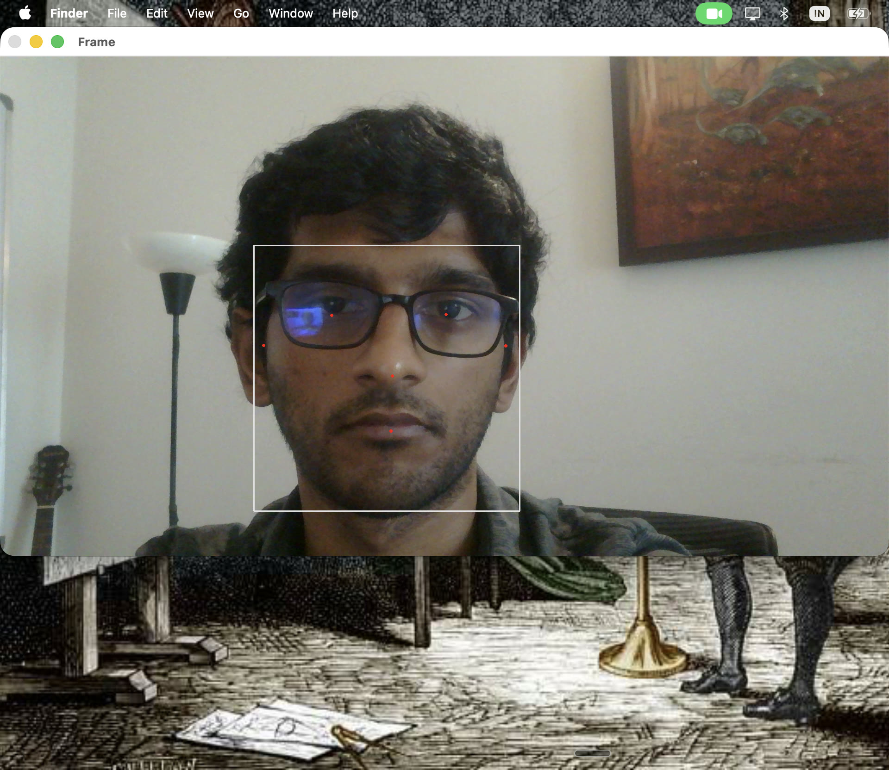

# day 11 — 2026-07-22

**goal:** first day of phase 2 — the video robot. get off the arduino and onto python on the mac: set up opencv + mediapipe, open the webcam, run face detection, draw a live bounding box, and print the face's center (x, y). that center coordinate is what will drive the pan/tilt servos later to keep my face in frame.

## what i built
- a python venv in `projects/02-video-robot/` with `opencv-python` + `mediapipe`. kept it isolated from system python (3.9.6) on purpose.
- `cam-test.py`: opens the ZEB webcam, runs a live loop, converts each frame BGR→RGB, feeds it to mediapipe face detection, draws the bounding box, and computes + prints the face center `(cx, cy)` in pixels every frame.
- it works: green box locks onto my face, and the terminal streams `cx cy` that track me — move right and `cx` climbs toward 1920, lean in and the box grows. that's the robot's future error signal ("face is at cx=1300, frame center is 960, so pan right").

## what broke
- **camera permission (the cursor wall).** running the script from inside cursor's terminal failed silently with `not authorized to capture video`. macos gates camera access **per app**, and cursor's helper process never got authorized. fix: run it from the real **Terminal.app**, which pops the permission dialog. edit in cursor, run in terminal.
- **wrong camera index.** `VideoCapture(1)` grabbed the built-in macbook cam, not the ZEB. turns out i only have two cameras (index 0 and 1) and the ZEB is **index 0** — the usb cam took the lower slot. confirmed it with the finger-over-the-lens test.
- **quotes inside a path string.** `cv.imread("'/…/physical.jpg'")` — i'd pasted a dragged path that included the single quotes, so the real path had literal `'` characters. `imread` didn't error, it just silently returned `None`. lesson: imread never raises on a bad path, it returns None — always guard.
- **the big one — `module 'mediapipe' has no attribute 'solutions'`.** the latest mediapipe (0.10.35) on apple silicon ships a **tasks-only build** with the legacy `mp.solutions` api stripped out — the module literally wasn't in the install. reinstalling did nothing (and i learned pip says "already satisfied" and skips rewriting files even when a previous install half-failed). fix: **downgrade to `mediapipe==0.10.14`**, which still ships `solutions`. my code didn't change at all — it was the library version, not me. pinned it in `requirements.txt` so i don't fall back into the trap.

## what i learned
- **macos camera access is per-app.** the permission attaches to whatever app launches python, which is why the same script fails in cursor and works in terminal.
- **opencv is BGR, everyone else is RGB.** you have to convert (`cvtColor(..., COLOR_BGR2RGB)`) before handing a frame to mediapipe, or detection quietly gets worse — no error, just bad results.
- **mediapipe gives normalized coordinates.** the bounding box comes back as fractions of the frame (0.0–1.0); multiply by frame width/height to get pixels. that normalized→pixel mapping is the same idea as day 12's pixels→angles.
- **newest isn't always right.** the current library version had the api ripped out; the fix was to pin an older one. version discipline matters.

## what i'm struggling with (honest)
- the code itself is **new to me** — this isn't the python i already knew, and i can tell phase 2 is going to be complex and need a lot of assistance. that's fine for now: the priority is **building it and getting a sense of it**, not mastering every line on day one.
- the one real bottleneck was the **venv setup** — remembering to activate it, knowing which python is actually running. the mediapipe error even *looked* like my code was wrong when it was really about which install was on the path. everything else went pretty smoothly.

## getting my footing (revision)
to make sure i'm actually understanding and not just copying, i revised some python fundamentals today:
- imports and variables (the stuff we already knew)
- a little **numpy**
- a little **pandas**
- an intro to **opencv** — especially `imread` and `imshow`
the rest is still a bit beyond me, and i'm still working through it. building first, deep understanding as i go.

## clips / photos

https://github.com/user-attachments/assets/d513fd5a-b1f7-4f14-b119-71392b886129

<!-- VIDEO: drag-drop ~/Downloads/day-11-face-box.mp4 into this file on GitHub for the playable inline demo.
     the committed copy at media/day-11/day-11-face-box.mp4 is archival (github won't play committed relative-path videos, only drag-dropped attachments). -->
